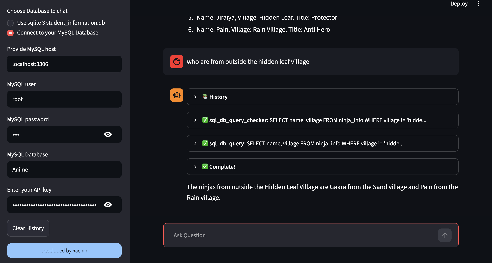

# 🗄️ SQL Chat Agent

An AI-powered chatbot that lets you **talk to your SQL database in plain English** — no SQL knowledge required. Built with LangChain, OpenAI GPT-4o-mini, and Streamlit.

🔗 **Live Demo:** [https://chatsql-agnet.streamlit.app/](https://chatsql-agnet.streamlit.app/)

---



---

## ✨ Features

- 💬 **Natural Language to SQL** — Ask questions in plain English; the agent writes and runs the SQL for you
- 🗃️ **SQLite Support** — Comes pre-loaded with a `student_batch_221.db` sample database, ready to query out of the box
- 🐬 **MySQL Support** — Connect to your own MySQL database via sidebar credentials
- 🔄 **Streaming Responses** — Real-time token-by-token output powered by LangChain's `StreamlitCallbackHandler`
- 🧠 **ReAct Agent** — Uses LangChain's Zero-Shot ReAct agent with up to 20 reasoning iterations
- 💾 **Chat History** — Persistent conversation history within the session with a one-click clear option
- 🔑 **Secure API Key Input** — Enter your OpenAI API key directly in the sidebar (never hardcoded)

---

## 🚀 Live Demo

Try it out instantly — no setup needed:

👉 [https://chatsql-agnet.streamlit.app/](https://chatsql-agnet.streamlit.app/)

> **Note:** The MySQL connection option requires running the app locally (the Streamlit cloud server cannot reach external databases).

---

## 🛠️ Tech Stack

| Layer | Technology |
|---|---|
| Frontend / UI | [Streamlit](https://streamlit.io/) |
| LLM | OpenAI GPT-4o-mini via [LangChain](https://www.langchain.com/) |
| SQL Agent | `langchain_community` SQL Agent + SQLDatabaseToolkit |
| Local DB | SQLite 3 (`student_batch_221.db`) |
| Remote DB | MySQL via `mysql-connector-python` |
| ORM / Engine | SQLAlchemy |
| Config | `python-dotenv` |

---

## 📦 Installation

### 1. Clone the repository

```bash
git clone https://github.com/Rachin02/Sql_Chat_Agent.git
cd Sql_Chat_Agent
```

### 2. Create and activate a virtual environment

```bash
python -m venv venv
source venv/bin/activate        # macOS / Linux
venv\Scripts\activate           # Windows
```

### 3. Install dependencies

```bash
pip install -r requirements.txt
```

### 4. Set up environment variables

Create a `.env` file in the root directory:

```env
OPENAI_API_KEY=your_openai_api_key_here
```

> Alternatively, you can enter your API key directly in the Streamlit sidebar at runtime.

### 5. Run the app

```bash
streamlit run app.py
```

---

## 🗂️ Project Structure

```
Sql_Chat_Agent/
│
├── app.py                      # Main Streamlit application
├── student_batch_221.db        # Sample SQLite database
├── requirements.txt            # Python dependencies
├── .env                        # Environment variables (not committed)
├── assets/
│   └── img                     # UI screenshot for README
└── README.md
```

---

## 🔌 Usage

### Using the SQLite Database (default)
1. Select **"Use sqlite 3 student_information.db"** in the sidebar
2. Enter your OpenAI API key
3. Start asking questions like:
   - *"How many students are in the database?"*
   - *"List all students from batch 221"*
   - *"What is the average grade of students?"*

### Using Your MySQL Database
1. Select **"Connect to your MySQL Database"** in the sidebar
2. Fill in your MySQL host, username, password, and database name
3. Enter your OpenAI API key
4. Ask questions about your own data

> ⚠️ MySQL support works only when running the app **locally**, not on the Streamlit Cloud deployment.

---

## ⚙️ How It Works

```
User Question (natural language)
        ↓
   LangChain ReAct Agent (GPT-4o-mini)
        ↓
   SQLDatabaseToolkit
        ↓
   Introspects DB schema → Generates SQL → Executes query
        ↓
   Interprets result → Streams response to user
```

The agent uses the **Zero-Shot ReAct** pattern: it reasons step-by-step, decides which SQL tool to call, inspects the schema, writes the query, runs it, and formulates a human-readable answer — all autonomously.

---

## 🔐 Security Notes

- The SQLite database is opened in **read-only mode** (`mode=ro`) to prevent accidental data modification.
- API keys are handled via sidebar input or `.env` and are never stored in the codebase.
- Do not commit your `.env` file — add it to `.gitignore`.

---

## 🤝 Contributing

Contributions, issues, and feature requests are welcome! Feel free to open an issue or submit a pull request.

---

## 👨‍💻 Developed by

**Rachin** — [GitHub](https://github.com/Rachin02)

---

## 📄 License

This project is open source and available under the [MIT License](LICENSE).
